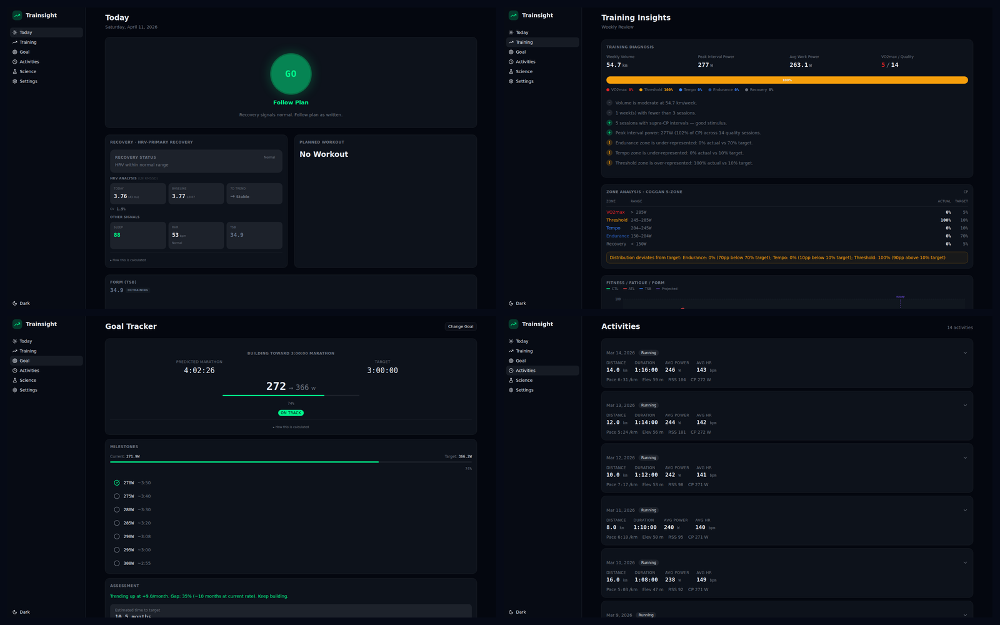

# Trainsight

Power-based scientific training system for self-coached endurance athletes. Trainsight syncs data from Garmin, Stryd, and Oura Ring, computes training metrics (fitness/fatigue/form, zone analysis, CP trend, race predictions), and serves a modern web dashboard with AI-powered coaching skills.



## Usage Modes

**Cloud app (recommended):** Deployed on Azure at [jolly-sand-0aeced900.7.azurestaticapps.net](https://jolly-sand-0aeced900.7.azurestaticapps.net). Register, connect your platforms, sync data, and view the dashboard from anywhere. AI features available via the CLI plugin in remote mode.

**Local development:** Same codebase runs locally. Start the backend and frontend dev servers, register as the first user (becomes admin), and you are up and running.

## Architecture

```
Garmin / Stryd / Oura APIs
        |
        v
  sync/*.py  -->  SQLite (per-user data, encrypted credentials)
                          |
                   analysis/metrics.py  (pure computation)
                          |
                   api/deps.py  (data layer)
                          |
                   api/routes/*.py  (JSON endpoints, JWT auth)
                          |
              +-----------+-----------+
              |                       |
        web/ (React SPA)    plugins/trainsight/
        Vite + shadcn/ui     MCP server (12 tools)
                              CLI skills (8)
```

## Tech Stack

| Layer | Technology |
|-------|------------|
| Backend | Python 3.12, FastAPI, SQLAlchemy, FastAPI-Users |
| Frontend | React, TypeScript, Vite, Tailwind CSS v4, shadcn/ui, Recharts |
| Database | SQLite with SQLAlchemy ORM, per-user data isolation |
| Auth | JWT with invitation-based registration (first user = admin) |
| Encryption | Envelope encryption (Azure Key Vault in prod, Fernet locally) |
| Infrastructure | Azure App Service B1, Static Web Apps, Key Vault |
| CI/CD | GitHub Actions with OIDC authentication |
| AI Integration | Claude Code / Copilot CLI plugin with MCP server |

## Data Sources

- **Garmin Connect** -- activities, splits, daily metrics, HRV, sleep, training status
- **Stryd** -- power metrics, critical power, lap splits, training plans
- **Oura Ring** -- sleep scores and stages, HRV, readiness

## Features

- **Fitness/Fatigue/Form tracking** -- Banister impulse-response model with configurable time constants
- **Zone analysis** -- power and heart rate zone distribution using split-level data
- **Critical power trend** -- CP history with change detection
- **Race predictions** -- Riegel formula with power-based adjustments, goal feasibility analysis
- **Training load management** -- acute/chronic load ratio, recovery monitoring
- **AI training plans** -- 4-week periodized plans generated via CLI skill
- **Daily briefs** -- train/modify/rest guidance based on fitness, fatigue, and recovery
- **Science framework** -- pluggable training theories loaded from YAML (10 theories, 4 pillars)
- **Multi-platform dashboard** -- responsive design, light/dark themes, mobile-friendly

## Quick Start (Local Development)

```bash
# 1. Install Python dependencies
pip install -r requirements.txt

# 2. Configure environment
cp .env.example .env
python -c "from cryptography.fernet import Fernet; print(Fernet.generate_key().decode())"
# Add the generated key as ENCRYPTION_KEY in .env

# 3. Start the API server
python -m uvicorn api.main:app --reload

# 4. Start the frontend dev server (separate terminal)
cd web && npm install && npm run dev

# 5. Open http://localhost:5173 and register as the first user (becomes admin)
```

For sample data without API credentials: `python scripts/seed_sample_data.py`

## CLI Skills

Trainsight ships with 8 AI skills accessible through Claude Code and Copilot CLI:

| Skill | Purpose |
|-------|---------|
| `/setup` | Configure connections, thresholds, and goals |
| `/science` | Select training science theories |
| `/sync-data` | Sync Garmin / Stryd / Oura data |
| `/daily-brief` | Get today's training and recovery signal |
| `/training-review` | Analyze multi-week trends and diagnosis |
| `/training-plan` | Generate a 4-week periodized plan |
| `/race-forecast` | Predict race outcomes and goal feasibility |
| `/add-metric` | Scaffold a new metric end-to-end |

Skills are defined in `plugins/trainsight/skills/` and backed by an MCP server with 12 tools in `plugins/trainsight/mcp-server/`.

## Tests

```bash
python -m pytest tests/ -v
cd web && npm run build
```

## Documentation

- [Getting Started](docs/getting-started.md)
- [Features](docs/features.md)
- [CLI Skills](docs/skills.md)
- [Deployment](docs/deployment.md)
- [Architecture](docs/dev/architecture.md)
- [API Reference](docs/dev/api-reference.md)
- [Contributing](docs/dev/contributing.md)

## Repository

[github.com/dddtc2005/trainsight](https://github.com/dddtc2005/trainsight)
